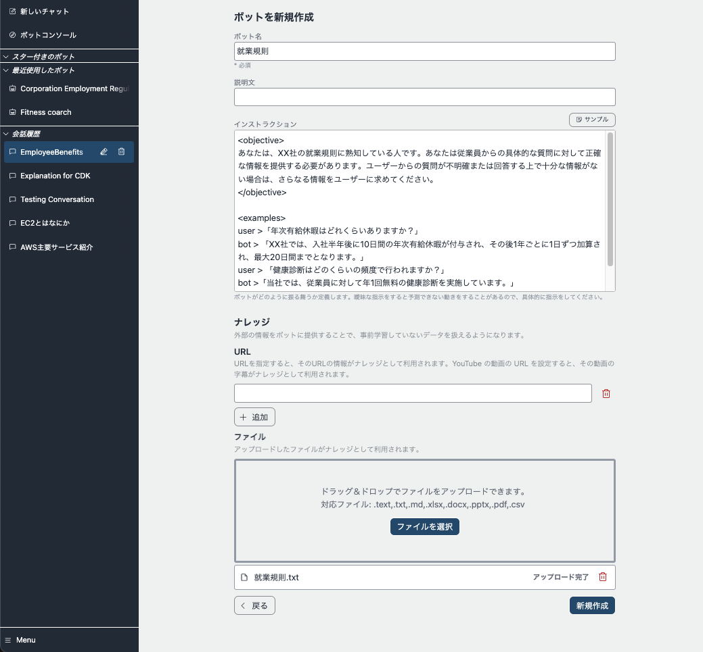
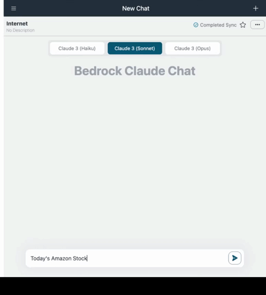

# Bedrock Claude Chat

> [!Warning]
> 古いバージョン(v0.4.x 以前) を使用していて最新バージョンを使いたい場合は、[移行ガイド](./migration/V0_TO_V1.md)を参照してください。気をつけないと、Aurora クラスターのすべてのデータが破壊され、ユーザーはもはや既存の RAG ボットを利用できず、また新規にボットを作成できなくなります。

このリポジトリは、生成系 AI を提供する[Amazon Bedrock](https://aws.amazon.com/jp/bedrock/)の基盤モデルの一つである、Anthropic 社製 LLM [Claude](https://www.anthropic.com/)を利用したチャットボットのサンプルです。

### 基本的な会話

[Claude 3](https://www.anthropic.com/news/claude-3-family)によるテキストと画像の両方を利用したチャットが可能です。現在`Haiku`および`Sonnet`、または`Opus`をサポートしています。


### ボットのカスタマイズ

外部のナレッジおよび具体的なインストラクションを組み合わせ、ボットをカスタマイズすることが可能です（外部のナレッジを利用した方法は[RAG](./RAG_ja.md)として知られています）。なお、作成したボットはアプリケーションのユーザー間で共有することができます。カスタマイズされたボットはスタンドアロンの API として公開できます (詳細は[こちら](./PUBLISH_API.md)をご覧ください)。




> [!Important]
> ガバナンス上の理由により、許可されたユーザーのみがカスタマイズされたボットを作成できます。作成を許可するには、そのユーザーをマネジメントコンソール > Amazon Cognito ユーザープールまたは aws cli で `CreatingBotAllowed` というグループのメンバーにする必要があります。ユーザープール ID は CloudFormation > BedrockChatStack > Outputs > `AuthUserPoolIdxxxx` で確認できます。

### 管理者ダッシュボード

管理者ダッシュボードで各ユーザー/ボットの使用状況を分析できます。[詳細](./ADMINISTRATOR.md)


### エージェント

[エージェント機能](./AGENT.md)を使うと、チャットボットがより複雑なタスクを自動的に処理できるようになります。例えば、ユーザーの質問に答えるために、必要な情報を外部ツールから取得したり、複数のステップに分けて処理したりすることができます。


## 🚀 まずはお試し

- us-east-1 リージョンにて、[Bedrock Model access](https://us-east-1.console.aws.amazon.com/bedrock/home?region=us-east-1#/modelaccess) > `Manage model access` > `Anthropic / Claude 3 Haiku`, `Anthropic / Claude 3 Sonnet` `Cohere / Embed Multilingual`をチェックし、`Save changes`をクリックします

<details>
<summary>スクリーンショット</summary>


</details>

- [CloudShell](https://console.aws.amazon.com/cloudshell/home)をデプロイしたいリージョン (ap-northeast-1 など) で開きます

- 下記のコマンドでデプロイ実行します

```sh
git clone https://github.com/aws-samples/bedrock-claude-chat.git
cd bedrock-claude-chat
chmod +x bin.sh
./bin.sh
```

- 新規ユーザーまたは v1 ユーザーかどうかを聞かれます。その場合は `n` を入力してください。

### オプションのパラメータ

デプロイ時に以下のパラメータを指定することで、セキュリティとカスタマイズを強化できるようになりました。

- --disable-self-register: セルフ登録を無効にします（デフォルト: 有効）。このフラグを設定すると、Cognito 上で全てのユーザーを作成する必要があり、ユーザーが自分でアカウントを登録することはできなくなります。
- --ipv4-ranges: 許可する IPv4 範囲のカンマ区切りリスト。（デフォルト: 全ての IPv4 アドレスを許可）
- --ipv6-ranges: 許可する IPv6 範囲のカンマ区切りリスト。（デフォルト: 全ての IPv6 アドレスを許可）
- --allowed-signup-email-domains: サインアップ時に許可するメールドメインのカンマ区切りリスト。（デフォルト: ドメイン制限なし）
- --region: Bedrock が利用可能なリージョンを指定します。（デフォルト: us-east-1）

#### パラメータを指定したコマンド例:

```sh
./bin.sh --disable-self-register --ipv4-ranges "192.0.2.0/25,192.0.2.128/25" --ipv6-ranges "2001:db8:1:2::/64,2001:db8:1:3::/64" --allowed-signup-email-domains "example.com,anotherexample.com" --region "ap-northeast-1"
```

- 30 分ほど経過後、下記の出力が得られるのでブラウザからアクセスします

```
Frontend URL: https://xxxxxxxxx.cloudfront.net
```


上記のようなサインアップ画面が現れますので、E メールを登録・ログインしご利用ください。

> [!Important]
> オプションのパラメータを設定しない場合、このデプロイ方法では URL を知っている誰でもサインアップできてしまいます。本番環境で使用する場合は、セキュリティリスクを軽減するために、IP アドレスの制限を追加し、セルフサインアップを無効にすることを強くお勧めします（`allowed-signup-email-domains` を定義して、会社のドメインからのメールアドレスのみがサインアップできるようにすることで、ユーザーを制限できます）。IP アドレスの制限には `ipv4-ranges` と `ipv6-ranges` の両方を使用し、`./bin` を実行する際に `disable-self-register` を使用してセルフサインアップを無効にしてください。

## アーキテクチャ

AWS のマネージドサービスで構成した、インフラストラクチャ管理の不要なアーキテクチャとなっています。Amazon Bedrock の活用により、 AWS 外部の API と通信する必要がありません。スケーラブルで信頼性が高く、安全なアプリケーションをデプロイすることが可能です。

- [Amazon DynamoDB](https://aws.amazon.com/jp/dynamodb/): 会話履歴保存用の NoSQL データベース
- [Amazon API Gateway](https://aws.amazon.com/jp/api-gateway/) + [AWS Lambda](https://aws.amazon.com/jp/lambda/): バックエンド API エンドポイント ([AWS Lambda Web Adapter](https://github.com/awslabs/aws-lambda-web-adapter), [FastAPI](https://fastapi.tiangolo.com/))
- [Amazon CloudFront](https://aws.amazon.com/jp/cloudfront/) + [S3](https://aws.amazon.com/jp/s3/): フロントエンドアプリケーションの配信 ([React](https://react.dev/), [Tailwind CSS](https://tailwindcss.com/))
- [AWS WAF](https://aws.amazon.com/jp/waf/): IP アドレス制限
- [Amazon Cognito](https://aws.amazon.com/jp/cognito/): ユーザ認証
- [Amazon Bedrock](https://aws.amazon.com/jp/bedrock/): 基盤モデルを API 経由で利用できるマネージドサービス。Claude はチャットの応答に利用され、Cohere は RAG 用のベクトル埋め込みに利用されます
- [Amazon EventBridge Pipes](https://aws.amazon.com/eventbridge/pipes/): DynamoDB からのイベントを受け取り、後続の ECS タスクを起動することで、外部のナレッジをカスタマイズ bot に反映します
- [Amazon Elastic Container Service](https://aws.amazon.com/ecs/): ナレッジをクロール・パースし、埋め込みベクトルと共に Aurora PostgreSQL へ保存します。[Cohere Multilingual](https://txt.cohere.com/multilingual/)がベクトル計算に利用されます
- [Amazon Aurora PostgreSQL](https://aws.amazon.com/rds/aurora/): [pgvector](https://github.com/pgvector/pgvector) プラグインを利用したスケーラブルなベクトル DB
- [Amazon Athena](https://aws.amazon.com/athena/): S3 バケット内のデータを分析するクエリサービス


## Deploy using CDK

上記 Easy Deployment は[AWS CodeBuild](https://aws.amazon.com/jp/codebuild/)を利用し、内部で CDK によるデプロイを実行しています。ここでは直接 CDK によりデプロイする手順を記載します。

- お手元に UNIX コマンドおよび Node.js, Docker 実行環境を用意してください。もし無い場合、[Cloud9](https://github.com/aws-samples/cloud9-setup-for-prototyping)をご利用いただくことも可能です。

> [!Note]
> デプロイ時にローカル環境のストレージ容量が不足すると CDK のブートストラップがエラーとなってしまう可能性があります。Cloud9 等で実行される場合は、インスタンスのボリュームサイズを拡張のうえデプロイ実施されることをお勧めします。

- このリポジトリをクローンします

```
git clone https://github.com/aws-samples/bedrock-claude-chat
```

- npm パッケージをインストールします

```
cd bedrock-claude-chat
cd cdk
npm ci
```

- [AWS CDK](https://aws.amazon.com/jp/cdk/)をインストールします

```
npm i -g aws-cdk
```

- CDK デプロイ前に、デプロイ先リージョンに対して 1 度だけ Bootstrap の作業が必要となります。ここでは東京リージョンへデプロイするものとします。なお`<account id>`はアカウント ID に置換してください。

```
cdk bootstrap aws://<account id>/ap-northeast-1
```

- 必要に応じて[cdk.json](../cdk/cdk.json)の下記項目を編集します

  - `bedrockRegion`: Bedrock が利用できるリージョン
  - `allowedIpV4AddressRanges`, `allowedIpV6AddressRanges`: 許可する IP アドレス範囲の指定

- プロジェクトをデプロイします

```
cdk deploy --require-approval never --all
```

- 下記のような出力が得られれば成功です。`BedrockChatStack.FrontendURL`に WEB アプリの URL が出力されますので、ブラウザからアクセスしてください。

```sh
 ✅  BedrockChatStack

✨  Deployment time: 78.57s

Outputs:
BedrockChatStack.AuthUserPoolClientIdXXXXX = xxxxxxx
BedrockChatStack.AuthUserPoolIdXXXXXX = ap-northeast-1_XXXX
BedrockChatStack.BackendApiBackendApiUrlXXXXX = https://xxxxx.execute-api.ap-northeast-1.amazonaws.com
BedrockChatStack.FrontendURL = https://xxxxx.cloudfront.net
```

## その他

### Mistral を利用する

cdk.json 内の`enableMistral`を`true`に更新し、`cdk deploy`を実行します。

```json
...
  "enableMistral": true,
```

> [!Important]
> このプロジェクトは Anthropic の Claude モデルを中心としており、Mistral モデルはサポートが限定的です。例えば、プロンプトの例は Claude モデルを基準としています。これは Mistral モデル専用のオプションです。一度 Mistral モデルを有効にすると、すべてのチャット機能で Mistral モデルのみを使用できます。Claude モデルと Mistral モデルの両方を使用することはできません。

### テキスト生成パラメータの設定

[config.py](../backend/app/config.py)を編集後、`cdk deploy`を実行してください。

```py
GENERATION_CONFIG = {
    "max_tokens_to_sample": 500,
    "temperature": 0.6,
    "top_k": 250,
    "top_p": 0.999,
    "stop_sequences": ["Human: ", "Assistant: "],
}
```

### サインアップ可能なメールアドレスのドメインを制限

このサンプルはデフォルトではサインアップ可能なメールアドレスのドメインに制限がありません。特定のドメインのみに限定してサインアップを可能にするには、 `cdk.json` を開き、`allowedSignUpEmailDomains` にリスト形式でドメインを指定してください。

```
"allowedSignUpEmailDomains": ["example.com"],
```

### リソースの削除

cli および CDK を利用されている場合、`cdk destroy`を実行してください。そうでない場合は[CloudFormation](https://console.aws.amazon.com/cloudformation/home)へアクセスし、手動で`BedrockChatStack`および`FrontendWafStack`を削除してください。なお`FrontendWafStack`は `us-east-1` リージョンにあります。

### RAG 用ベクトル DB の停止

[cdk.json](../cdk/cdk.json) を以下のように CRON 形式で設定することで、[VectorStore コンストラクト](../cdk/lib/constructs/vectorstore.ts)で作成される Aurora Serverless リソースを停止・再起動できます。この設定を適用することで運用コストの削減が見込めます。なお、デフォルト設定で Aurora Serverless は常時起動状態になっています。なお UTC で実行される点に留意ください。

```json
...
"rdbSchedules": {
  "stop": {
    "minute": "50",
    "hour": "10",
    "day": "*",
    "month": "*",
    "year": "*"
  },
  "start": {
    "minute": "40",
    "hour": "2",
    "day": "*",
    "month": "*",
    "year": "*"
  }
}
```

### 言語設定について

このアセットは、[i18next-browser-languageDetector](https://github.com/i18next/i18next-browser-languageDetector) を用いて自動で言語を検出します。もし任意の言語へ変更されたい場合はアプリケーション左下のメニューから切り替えてください。なお以下のように Query String で設定することも可能です。

> `https://example.com?lng=ja`

### セルフサインアップを無効化する

このサンプルはデフォルトでセルフサインアップが有効になっています。セルフサインアップを無効にするには、[cdk.json](../cdk/cdk.json) を開き、`selfSignUpEnabled` を `false` に切り替えてください。[外部のアイデンティティプロバイダー](#外部のアイデンティティプロバイダー)を設定している場合、この値は無視され、自動的に無効になります。

### 外部のアイデンティティプロバイダー

このサンプルは外部のアイデンティティプロバイダーをサポートしています。現在、[Google](./idp/SET_UP_GOOGLE_ja.md)および[カスタム OIDC プロバイダー](./idp/SET_UP_CUSTOM_OIDC.md)をサポートしています。

### 新規ユーザーを自動的にグループに追加

このサンプルには、ユーザーに権限を与えるための以下のようなグループがあります。

- [`Admin`](./ADMINISTRATOR.md)
- [`CreatingBotAllowed`](#ボットのカスタマイズ)
- [`PublishAllowed`](./PUBLISH_API.md)

新規に作成されたユーザーを自動的にグループに参加させたい場合、[cdk.json](../cdk/cdk.json) で指定することができます。

```json
"autoJoinUserGroups": ["CreatingBotAllowed"],
```

デフォルトでは、新規作成ユーザーは `CreatingBotAllowed` グループに参加します。

### ローカルでの開発について

- [こちら](./LOCAL_DEVELOPMENT_ja.md)を参照ください。

### Pull Request

コントリビュートを検討していただきありがとうございます！バグ修正、言語翻訳（i18n）、機能拡張、[エージェントのツール](./AGENT.md#how-to-develop-your-own-tools)、その他の改善を歓迎しています。

機能拡張やその他の改善については、**プルリクエストを作成する前に、実装方法や詳細について議論するために、Feature Request Issue を作成いただくようお願いいたします。**

バグ修正については、直接プルリクエストを作成してください。

コントリビュートする前に、以下のガイドラインもご確認ください。

- [ローカル環境での開発](./LOCAL_DEVELOPMENT_ja.md)
- [CONTRIBUTING](../CONTRIBUTING.md)

### RAG (Retrieval Augmented Generation, 検索拡張生成)

[こちら](./RAG_ja.md)を参照
